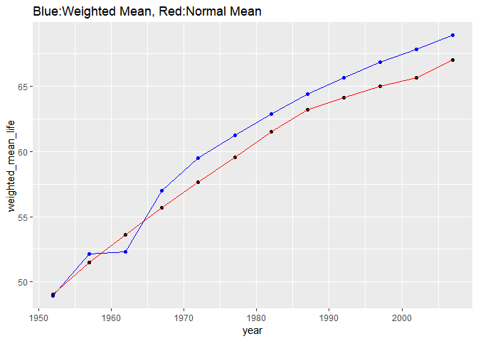

Hw-03\_gapminder
================
Chenchen Guo
2018 Sep 26th

R Markdown
----------

``` r
# Load gapminder and ggplot2 package

suppressPackageStartupMessages(library(gapminder))
suppressPackageStartupMessages(library(ggplot2))
suppressPackageStartupMessages(library(tidyverse))
suppressPackageStartupMessages(library(knitr))
suppressPackageStartupMessages(library(kableExtra))


# For ggplot2 package, gonna use: scatter plot, line plot, historgram plot, density plot, box and violin plot,jitter plot, bubble plots, bar plot, overplot,path plot, facetting.

# For dplyr package, gonna use: filter(), arrange(), select(), rename(), mutate(), transmute(), summarise(), sample_n(), sample_frac().
```

``` r
#First list the basic information of dataset: gapminder
#this part of code is to show basic information of gapminder data set
typeof(gapminder)
```

    ## [1] "list"

``` r
ls(gapminder)
```

    ## [1] "continent" "country"   "gdpPercap" "lifeExp"   "pop"       "year"

``` r
dim(gapminder)
```

    ## [1] 1704    6

``` r
# same as ncol and nrow
head(gapminder)
```

    ## # A tibble: 6 x 6
    ##   country     continent  year lifeExp      pop gdpPercap
    ##   <fctr>      <fctr>    <int>   <dbl>    <int>     <dbl>
    ## 1 Afghanistan Asia       1952    28.8  8425333       779
    ## 2 Afghanistan Asia       1957    30.3  9240934       821
    ## 3 Afghanistan Asia       1962    32.0 10267083       853
    ## 4 Afghanistan Asia       1967    34.0 11537966       836
    ## 5 Afghanistan Asia       1972    36.1 13079460       740
    ## 6 Afghanistan Asia       1977    38.4 14880372       786

``` r
list(gapminder)
```

    ## [[1]]
    ## # A tibble: 1,704 x 6
    ##    country     continent  year lifeExp      pop gdpPercap
    ##    <fctr>      <fctr>    <int>   <dbl>    <int>     <dbl>
    ##  1 Afghanistan Asia       1952    28.8  8425333       779
    ##  2 Afghanistan Asia       1957    30.3  9240934       821
    ##  3 Afghanistan Asia       1962    32.0 10267083       853
    ##  4 Afghanistan Asia       1967    34.0 11537966       836
    ##  5 Afghanistan Asia       1972    36.1 13079460       740
    ##  6 Afghanistan Asia       1977    38.4 14880372       786
    ##  7 Afghanistan Asia       1982    39.9 12881816       978
    ##  8 Afghanistan Asia       1987    40.8 13867957       852
    ##  9 Afghanistan Asia       1992    41.7 16317921       649
    ## 10 Afghanistan Asia       1997    41.8 22227415       635
    ## # ... with 1,694 more rows

``` r
summary(gapminder)
```

    ##         country        continent        year         lifeExp     
    ##  Afghanistan:  12   Africa  :624   Min.   :1952   Min.   :23.60  
    ##  Albania    :  12   Americas:300   1st Qu.:1966   1st Qu.:48.20  
    ##  Algeria    :  12   Asia    :396   Median :1980   Median :60.71  
    ##  Angola     :  12   Europe  :360   Mean   :1980   Mean   :59.47  
    ##  Argentina  :  12   Oceania : 24   3rd Qu.:1993   3rd Qu.:70.85  
    ##  Australia  :  12                  Max.   :2007   Max.   :82.60  
    ##  (Other)    :1632                                                
    ##       pop              gdpPercap       
    ##  Min.   :6.001e+04   Min.   :   241.2  
    ##  1st Qu.:2.794e+06   1st Qu.:  1202.1  
    ##  Median :7.024e+06   Median :  3531.8  
    ##  Mean   :2.960e+07   Mean   :  7215.3  
    ##  3rd Qu.:1.959e+07   3rd Qu.:  9325.5  
    ##  Max.   :1.319e+09   Max.   :113523.1  
    ## 

``` r
str(gapminder)
```

    ## Classes 'tbl_df', 'tbl' and 'data.frame':    1704 obs. of  6 variables:
    ##  $ country  : Factor w/ 142 levels "Afghanistan",..: 1 1 1 1 1 1 1 1 1 1 ...
    ##  $ continent: Factor w/ 5 levels "Africa","Americas",..: 3 3 3 3 3 3 3 3 3 3 ...
    ##  $ year     : int  1952 1957 1962 1967 1972 1977 1982 1987 1992 1997 ...
    ##  $ lifeExp  : num  28.8 30.3 32 34 36.1 ...
    ##  $ pop      : int  8425333 9240934 10267083 11537966 13079460 14880372 12881816 13867957 16317921 22227415 ...
    ##  $ gdpPercap: num  779 821 853 836 740 ...

``` r
# Task 1: Get the minimum and maximum of GDP per capita for all continents

# In order to observe the max and min GdpPercap for all continents, using group_by() and summarize() function and using knitr::kable to indicate the data.
Gdp=gapminder %>% 
  group_by(continent) %>% 
  summarize(Maxgdp=max(gdpPercap), Mingdp=min(gdpPercap))

knitr::kable(Gdp) %>% 
  kable_styling(bootstrap_options = "bordered",latex_options = "basic",full_width = F)
```

<table class="table table-bordered" style="width: auto !important; margin-left: auto; margin-right: auto;">
<thead>
<tr>
<th style="text-align:left;">
continent
</th>
<th style="text-align:right;">
Maxgdp
</th>
<th style="text-align:right;">
Mingdp
</th>
</tr>
</thead>
<tbody>
<tr>
<td style="text-align:left;">
Africa
</td>
<td style="text-align:right;">
21951.21
</td>
<td style="text-align:right;">
241.1659
</td>
</tr>
<tr>
<td style="text-align:left;">
Americas
</td>
<td style="text-align:right;">
42951.65
</td>
<td style="text-align:right;">
1201.6372
</td>
</tr>
<tr>
<td style="text-align:left;">
Asia
</td>
<td style="text-align:right;">
113523.13
</td>
<td style="text-align:right;">
331.0000
</td>
</tr>
<tr>
<td style="text-align:left;">
Europe
</td>
<td style="text-align:right;">
49357.19
</td>
<td style="text-align:right;">
973.5332
</td>
</tr>
<tr>
<td style="text-align:left;">
Oceania
</td>
<td style="text-align:right;">
34435.37
</td>
<td style="text-align:right;">
10039.5956
</td>
</tr>
</tbody>
</table>
``` r
Gdp %>% 
  ggplot(aes(continent,Maxgdp, fill=continent))+
  geom_col()+xlab("Continent")+ylab("Maximum GdpPercap")+
  ggtitle("Maximum GdpPercap of each continent")
```


``` r
Gdp %>% 
  ggplot(aes(continent,Mingdp,fill=continent))+
  geom_col()+xlab("Continent")+ylab("Minimum GdpPercap")+
  ggtitle("Minimum GdpPercap of each continent")
```


``` r
gapminder %>% 
  ggplot(aes(continent,gdpPercap,color=continent))+
  geom_violin()+ xlab("Continent")+ylab("Maximum GdpPercap")+
  ggtitle(" GdpPercap distribution of each continent")
```


``` r
# To interprate data visually, using scatter plot and line fitting, to show the tendency of each one.
trend= gapminder %>% 
  group_by(continent, year) %>% 
  summarize(Maxigdp=max(gdpPercap), Minigdp=min(gdpPercap))
trend %>% 
  ggplot(aes(year, Maxigdp,shape=continent, color=continent))+
  geom_point()+
  geom_line()+xlab("Year")+ylab("Maximum GdpPercap")+
  ggtitle("Trend of Maximum GdpPercap for each continent")
```


``` r
trend %>% 
  ggplot(aes(year, Minigdp,shape=continent, color=continent))+
  geom_point()+
  geom_line()+xlab("Year")+ylab("Minimum GdpPercap")+
  ggtitle("Trend of Minimum GdpPercap for each continent")
```


``` r
#Task 2: Look the spread of GDP per capita within the continents
# Firstly, using hist plot to partly showing GDPpercap data of each continent and showing the density of distribution for Gdp of each continent.
gapminder %>% 
  ggplot(aes(gdpPercap, fill=continent))+
  facet_wrap(~ continent, scales = "free_y")+
  geom_histogram()+xlab("GDPpercap")+ylab("Count")+
  ggtitle("GDP spread of each continent")
```

    ## `stat_bin()` using `bins = 30`. Pick better value with `binwidth`.


``` r
gapminder %>% 
  ggplot(aes(gdpPercap, fill=continent))+
  facet_wrap(~continent)+
  geom_density()+xlab("GDPpercap")+ylab("Count")+
  ggtitle("GDP distribution of each continent")
```


``` r
# Then through grouping by continent, using summarize() function to inteprate data.
tbgdp= gapminder %>% 
  group_by(continent) %>% 
  summarize(Min=min(gdpPercap), Mean=mean(gdpPercap), Median=median(gdpPercap), Max=max(gdpPercap))
knitr::kable(tbgdp) %>% 
  kable_styling(bootstrap_options = "bordered",latex_options = "basic",full_width = F)
```

<table class="table table-bordered" style="width: auto !important; margin-left: auto; margin-right: auto;">
<thead>
<tr>
<th style="text-align:left;">
continent
</th>
<th style="text-align:right;">
Min
</th>
<th style="text-align:right;">
Mean
</th>
<th style="text-align:right;">
Median
</th>
<th style="text-align:right;">
Max
</th>
</tr>
</thead>
<tbody>
<tr>
<td style="text-align:left;">
Africa
</td>
<td style="text-align:right;">
241.1659
</td>
<td style="text-align:right;">
2193.755
</td>
<td style="text-align:right;">
1192.138
</td>
<td style="text-align:right;">
21951.21
</td>
</tr>
<tr>
<td style="text-align:left;">
Americas
</td>
<td style="text-align:right;">
1201.6372
</td>
<td style="text-align:right;">
7136.110
</td>
<td style="text-align:right;">
5465.510
</td>
<td style="text-align:right;">
42951.65
</td>
</tr>
<tr>
<td style="text-align:left;">
Asia
</td>
<td style="text-align:right;">
331.0000
</td>
<td style="text-align:right;">
7902.150
</td>
<td style="text-align:right;">
2646.787
</td>
<td style="text-align:right;">
113523.13
</td>
</tr>
<tr>
<td style="text-align:left;">
Europe
</td>
<td style="text-align:right;">
973.5332
</td>
<td style="text-align:right;">
14469.476
</td>
<td style="text-align:right;">
12081.749
</td>
<td style="text-align:right;">
49357.19
</td>
</tr>
<tr>
<td style="text-align:left;">
Oceania
</td>
<td style="text-align:right;">
10039.5956
</td>
<td style="text-align:right;">
18621.609
</td>
<td style="text-align:right;">
17983.304
</td>
<td style="text-align:right;">
34435.37
</td>
</tr>
</tbody>
</table>
``` r
# Task 3: Compute the trimmed mean of life expectancy for different years. Or a weighted mean, weighting by population. Just try something other than the plain vanilla mean.


# Here, trimmed mean coefficient has been set to 0.25, which means quarter part of begin and end data are ignored.
trimmed=gapminder %>% 
  group_by(year) %>% 
  summarize(mean_lifeexp=mean(lifeExp), trimmed_mean_lifeexp=mean(lifeExp,trim = 0.25)) %>% 
  arrange(year)

knitr::kable(trimmed) %>% 
  kable_styling(bootstrap_options = "bordered",latex_options = "basic",full_width = F)
```

<table class="table table-bordered" style="width: auto !important; margin-left: auto; margin-right: auto;">
<thead>
<tr>
<th style="text-align:right;">
year
</th>
<th style="text-align:right;">
mean\_lifeexp
</th>
<th style="text-align:right;">
trimmed\_mean\_lifeexp
</th>
</tr>
</thead>
<tbody>
<tr>
<td style="text-align:right;">
1952
</td>
<td style="text-align:right;">
49.05762
</td>
<td style="text-align:right;">
47.33607
</td>
</tr>
<tr>
<td style="text-align:right;">
1957
</td>
<td style="text-align:right;">
51.50740
</td>
<td style="text-align:right;">
50.27669
</td>
</tr>
<tr>
<td style="text-align:right;">
1962
</td>
<td style="text-align:right;">
53.60925
</td>
<td style="text-align:right;">
52.79151
</td>
</tr>
<tr>
<td style="text-align:right;">
1967
</td>
<td style="text-align:right;">
55.67829
</td>
<td style="text-align:right;">
55.43138
</td>
</tr>
<tr>
<td style="text-align:right;">
1972
</td>
<td style="text-align:right;">
57.64739
</td>
<td style="text-align:right;">
58.07853
</td>
</tr>
<tr>
<td style="text-align:right;">
1977
</td>
<td style="text-align:right;">
59.57016
</td>
<td style="text-align:right;">
60.46878
</td>
</tr>
<tr>
<td style="text-align:right;">
1982
</td>
<td style="text-align:right;">
61.53320
</td>
<td style="text-align:right;">
62.70044
</td>
</tr>
<tr>
<td style="text-align:right;">
1987
</td>
<td style="text-align:right;">
63.21261
</td>
<td style="text-align:right;">
64.76540
</td>
</tr>
<tr>
<td style="text-align:right;">
1992
</td>
<td style="text-align:right;">
64.16034
</td>
<td style="text-align:right;">
66.19274
</td>
</tr>
<tr>
<td style="text-align:right;">
1997
</td>
<td style="text-align:right;">
65.01468
</td>
<td style="text-align:right;">
67.25389
</td>
</tr>
<tr>
<td style="text-align:right;">
2002
</td>
<td style="text-align:right;">
65.69492
</td>
<td style="text-align:right;">
68.30965
</td>
</tr>
<tr>
<td style="text-align:right;">
2007
</td>
<td style="text-align:right;">
67.00742
</td>
<td style="text-align:right;">
69.68886
</td>
</tr>
</tbody>
</table>
``` r
# Here, two line of both trimmed mean and normal mean are shown in a figure to separately indicate the tendency.
ggplot(trimmed,aes(year,trimmed_mean_lifeexp))+
  geom_point(color="blue")+
  geom_line(color="blue")+
  geom_point(aes(year,mean_lifeexp))+
  geom_line(aes(year,mean_lifeexp),color="red")+
  ggtitle("Blue:Trimmed Mean, Red: Normal Mean")
```


``` r
# similarly to upper code, the weighted mean has been arranged by year.
weighted=gapminder %>% 
  group_by(year) %>% 
  summarize(mean=mean(lifeExp),weighted_mean_life=weighted.mean(lifeExp,pop)) %>% 
  arrange(year)

knitr::kable(weighted) %>% 
  kable_styling(bootstrap_options = "bordered",latex_options = "basic",full_width = F)
```

<table class="table table-bordered" style="width: auto !important; margin-left: auto; margin-right: auto;">
<thead>
<tr>
<th style="text-align:right;">
year
</th>
<th style="text-align:right;">
mean
</th>
<th style="text-align:right;">
weighted\_mean\_life
</th>
</tr>
</thead>
<tbody>
<tr>
<td style="text-align:right;">
1952
</td>
<td style="text-align:right;">
49.05762
</td>
<td style="text-align:right;">
48.94424
</td>
</tr>
<tr>
<td style="text-align:right;">
1957
</td>
<td style="text-align:right;">
51.50740
</td>
<td style="text-align:right;">
52.12189
</td>
</tr>
<tr>
<td style="text-align:right;">
1962
</td>
<td style="text-align:right;">
53.60925
</td>
<td style="text-align:right;">
52.32438
</td>
</tr>
<tr>
<td style="text-align:right;">
1967
</td>
<td style="text-align:right;">
55.67829
</td>
<td style="text-align:right;">
56.98431
</td>
</tr>
<tr>
<td style="text-align:right;">
1972
</td>
<td style="text-align:right;">
57.64739
</td>
<td style="text-align:right;">
59.51478
</td>
</tr>
<tr>
<td style="text-align:right;">
1977
</td>
<td style="text-align:right;">
59.57016
</td>
<td style="text-align:right;">
61.23726
</td>
</tr>
<tr>
<td style="text-align:right;">
1982
</td>
<td style="text-align:right;">
61.53320
</td>
<td style="text-align:right;">
62.88176
</td>
</tr>
<tr>
<td style="text-align:right;">
1987
</td>
<td style="text-align:right;">
63.21261
</td>
<td style="text-align:right;">
64.41635
</td>
</tr>
<tr>
<td style="text-align:right;">
1992
</td>
<td style="text-align:right;">
64.16034
</td>
<td style="text-align:right;">
65.64590
</td>
</tr>
<tr>
<td style="text-align:right;">
1997
</td>
<td style="text-align:right;">
65.01468
</td>
<td style="text-align:right;">
66.84934
</td>
</tr>
<tr>
<td style="text-align:right;">
2002
</td>
<td style="text-align:right;">
65.69492
</td>
<td style="text-align:right;">
67.83904
</td>
</tr>
<tr>
<td style="text-align:right;">
2007
</td>
<td style="text-align:right;">
67.00742
</td>
<td style="text-align:right;">
68.91909
</td>
</tr>
</tbody>
</table>
``` r
# both normal mean and weighted mean are shown in one figure.
ggplot(weighted,aes(year,weighted_mean_life))+
  geom_point(color="blue")+
  geom_line(color="blue")+
  geom_point(aes(year,mean))+
  geom_line(aes(year,mean),color="red")+
  ggtitle("Blue:Weighted Mean, Red:Normal Mean")
```



``` r
# Task 4: How is the life Expectancy changing over time on different continents?
# using summarize() function to show all mean, max and mini lifeexp by year.
lifechange=gapminder %>% 
  group_by(continent, year) %>% 
  summarize(Mean_lifeexp=mean(lifeExp), Max_lifeexp=max(lifeExp), Min_lifeexp=min(lifeExp))

knitr::kable(lifechange) %>% 
  kable_styling(bootstrap_options = "bordered",latex_options = "basic",full_width = F)
```

<table class="table table-bordered" style="width: auto !important; margin-left: auto; margin-right: auto;">
<thead>
<tr>
<th style="text-align:left;">
continent
</th>
<th style="text-align:right;">
year
</th>
<th style="text-align:right;">
Mean\_lifeexp
</th>
<th style="text-align:right;">
Max\_lifeexp
</th>
<th style="text-align:right;">
Min\_lifeexp
</th>
</tr>
</thead>
<tbody>
<tr>
<td style="text-align:left;">
Africa
</td>
<td style="text-align:right;">
1952
</td>
<td style="text-align:right;">
39.13550
</td>
<td style="text-align:right;">
52.724
</td>
<td style="text-align:right;">
30.000
</td>
</tr>
<tr>
<td style="text-align:left;">
Africa
</td>
<td style="text-align:right;">
1957
</td>
<td style="text-align:right;">
41.26635
</td>
<td style="text-align:right;">
58.089
</td>
<td style="text-align:right;">
31.570
</td>
</tr>
<tr>
<td style="text-align:left;">
Africa
</td>
<td style="text-align:right;">
1962
</td>
<td style="text-align:right;">
43.31944
</td>
<td style="text-align:right;">
60.246
</td>
<td style="text-align:right;">
32.767
</td>
</tr>
<tr>
<td style="text-align:left;">
Africa
</td>
<td style="text-align:right;">
1967
</td>
<td style="text-align:right;">
45.33454
</td>
<td style="text-align:right;">
61.557
</td>
<td style="text-align:right;">
34.113
</td>
</tr>
<tr>
<td style="text-align:left;">
Africa
</td>
<td style="text-align:right;">
1972
</td>
<td style="text-align:right;">
47.45094
</td>
<td style="text-align:right;">
64.274
</td>
<td style="text-align:right;">
35.400
</td>
</tr>
<tr>
<td style="text-align:left;">
Africa
</td>
<td style="text-align:right;">
1977
</td>
<td style="text-align:right;">
49.58042
</td>
<td style="text-align:right;">
67.064
</td>
<td style="text-align:right;">
36.788
</td>
</tr>
<tr>
<td style="text-align:left;">
Africa
</td>
<td style="text-align:right;">
1982
</td>
<td style="text-align:right;">
51.59287
</td>
<td style="text-align:right;">
69.885
</td>
<td style="text-align:right;">
38.445
</td>
</tr>
<tr>
<td style="text-align:left;">
Africa
</td>
<td style="text-align:right;">
1987
</td>
<td style="text-align:right;">
53.34479
</td>
<td style="text-align:right;">
71.913
</td>
<td style="text-align:right;">
39.906
</td>
</tr>
<tr>
<td style="text-align:left;">
Africa
</td>
<td style="text-align:right;">
1992
</td>
<td style="text-align:right;">
53.62958
</td>
<td style="text-align:right;">
73.615
</td>
<td style="text-align:right;">
23.599
</td>
</tr>
<tr>
<td style="text-align:left;">
Africa
</td>
<td style="text-align:right;">
1997
</td>
<td style="text-align:right;">
53.59827
</td>
<td style="text-align:right;">
74.772
</td>
<td style="text-align:right;">
36.087
</td>
</tr>
<tr>
<td style="text-align:left;">
Africa
</td>
<td style="text-align:right;">
2002
</td>
<td style="text-align:right;">
53.32523
</td>
<td style="text-align:right;">
75.744
</td>
<td style="text-align:right;">
39.193
</td>
</tr>
<tr>
<td style="text-align:left;">
Africa
</td>
<td style="text-align:right;">
2007
</td>
<td style="text-align:right;">
54.80604
</td>
<td style="text-align:right;">
76.442
</td>
<td style="text-align:right;">
39.613
</td>
</tr>
<tr>
<td style="text-align:left;">
Americas
</td>
<td style="text-align:right;">
1952
</td>
<td style="text-align:right;">
53.27984
</td>
<td style="text-align:right;">
68.750
</td>
<td style="text-align:right;">
37.579
</td>
</tr>
<tr>
<td style="text-align:left;">
Americas
</td>
<td style="text-align:right;">
1957
</td>
<td style="text-align:right;">
55.96028
</td>
<td style="text-align:right;">
69.960
</td>
<td style="text-align:right;">
40.696
</td>
</tr>
<tr>
<td style="text-align:left;">
Americas
</td>
<td style="text-align:right;">
1962
</td>
<td style="text-align:right;">
58.39876
</td>
<td style="text-align:right;">
71.300
</td>
<td style="text-align:right;">
43.428
</td>
</tr>
<tr>
<td style="text-align:left;">
Americas
</td>
<td style="text-align:right;">
1967
</td>
<td style="text-align:right;">
60.41092
</td>
<td style="text-align:right;">
72.130
</td>
<td style="text-align:right;">
45.032
</td>
</tr>
<tr>
<td style="text-align:left;">
Americas
</td>
<td style="text-align:right;">
1972
</td>
<td style="text-align:right;">
62.39492
</td>
<td style="text-align:right;">
72.880
</td>
<td style="text-align:right;">
46.714
</td>
</tr>
<tr>
<td style="text-align:left;">
Americas
</td>
<td style="text-align:right;">
1977
</td>
<td style="text-align:right;">
64.39156
</td>
<td style="text-align:right;">
74.210
</td>
<td style="text-align:right;">
49.923
</td>
</tr>
<tr>
<td style="text-align:left;">
Americas
</td>
<td style="text-align:right;">
1982
</td>
<td style="text-align:right;">
66.22884
</td>
<td style="text-align:right;">
75.760
</td>
<td style="text-align:right;">
51.461
</td>
</tr>
<tr>
<td style="text-align:left;">
Americas
</td>
<td style="text-align:right;">
1987
</td>
<td style="text-align:right;">
68.09072
</td>
<td style="text-align:right;">
76.860
</td>
<td style="text-align:right;">
53.636
</td>
</tr>
<tr>
<td style="text-align:left;">
Americas
</td>
<td style="text-align:right;">
1992
</td>
<td style="text-align:right;">
69.56836
</td>
<td style="text-align:right;">
77.950
</td>
<td style="text-align:right;">
55.089
</td>
</tr>
<tr>
<td style="text-align:left;">
Americas
</td>
<td style="text-align:right;">
1997
</td>
<td style="text-align:right;">
71.15048
</td>
<td style="text-align:right;">
78.610
</td>
<td style="text-align:right;">
56.671
</td>
</tr>
<tr>
<td style="text-align:left;">
Americas
</td>
<td style="text-align:right;">
2002
</td>
<td style="text-align:right;">
72.42204
</td>
<td style="text-align:right;">
79.770
</td>
<td style="text-align:right;">
58.137
</td>
</tr>
<tr>
<td style="text-align:left;">
Americas
</td>
<td style="text-align:right;">
2007
</td>
<td style="text-align:right;">
73.60812
</td>
<td style="text-align:right;">
80.653
</td>
<td style="text-align:right;">
60.916
</td>
</tr>
<tr>
<td style="text-align:left;">
Asia
</td>
<td style="text-align:right;">
1952
</td>
<td style="text-align:right;">
46.31439
</td>
<td style="text-align:right;">
65.390
</td>
<td style="text-align:right;">
28.801
</td>
</tr>
<tr>
<td style="text-align:left;">
Asia
</td>
<td style="text-align:right;">
1957
</td>
<td style="text-align:right;">
49.31854
</td>
<td style="text-align:right;">
67.840
</td>
<td style="text-align:right;">
30.332
</td>
</tr>
<tr>
<td style="text-align:left;">
Asia
</td>
<td style="text-align:right;">
1962
</td>
<td style="text-align:right;">
51.56322
</td>
<td style="text-align:right;">
69.390
</td>
<td style="text-align:right;">
31.997
</td>
</tr>
<tr>
<td style="text-align:left;">
Asia
</td>
<td style="text-align:right;">
1967
</td>
<td style="text-align:right;">
54.66364
</td>
<td style="text-align:right;">
71.430
</td>
<td style="text-align:right;">
34.020
</td>
</tr>
<tr>
<td style="text-align:left;">
Asia
</td>
<td style="text-align:right;">
1972
</td>
<td style="text-align:right;">
57.31927
</td>
<td style="text-align:right;">
73.420
</td>
<td style="text-align:right;">
36.088
</td>
</tr>
<tr>
<td style="text-align:left;">
Asia
</td>
<td style="text-align:right;">
1977
</td>
<td style="text-align:right;">
59.61056
</td>
<td style="text-align:right;">
75.380
</td>
<td style="text-align:right;">
31.220
</td>
</tr>
<tr>
<td style="text-align:left;">
Asia
</td>
<td style="text-align:right;">
1982
</td>
<td style="text-align:right;">
62.61794
</td>
<td style="text-align:right;">
77.110
</td>
<td style="text-align:right;">
39.854
</td>
</tr>
<tr>
<td style="text-align:left;">
Asia
</td>
<td style="text-align:right;">
1987
</td>
<td style="text-align:right;">
64.85118
</td>
<td style="text-align:right;">
78.670
</td>
<td style="text-align:right;">
40.822
</td>
</tr>
<tr>
<td style="text-align:left;">
Asia
</td>
<td style="text-align:right;">
1992
</td>
<td style="text-align:right;">
66.53721
</td>
<td style="text-align:right;">
79.360
</td>
<td style="text-align:right;">
41.674
</td>
</tr>
<tr>
<td style="text-align:left;">
Asia
</td>
<td style="text-align:right;">
1997
</td>
<td style="text-align:right;">
68.02052
</td>
<td style="text-align:right;">
80.690
</td>
<td style="text-align:right;">
41.763
</td>
</tr>
<tr>
<td style="text-align:left;">
Asia
</td>
<td style="text-align:right;">
2002
</td>
<td style="text-align:right;">
69.23388
</td>
<td style="text-align:right;">
82.000
</td>
<td style="text-align:right;">
42.129
</td>
</tr>
<tr>
<td style="text-align:left;">
Asia
</td>
<td style="text-align:right;">
2007
</td>
<td style="text-align:right;">
70.72848
</td>
<td style="text-align:right;">
82.603
</td>
<td style="text-align:right;">
43.828
</td>
</tr>
<tr>
<td style="text-align:left;">
Europe
</td>
<td style="text-align:right;">
1952
</td>
<td style="text-align:right;">
64.40850
</td>
<td style="text-align:right;">
72.670
</td>
<td style="text-align:right;">
43.585
</td>
</tr>
<tr>
<td style="text-align:left;">
Europe
</td>
<td style="text-align:right;">
1957
</td>
<td style="text-align:right;">
66.70307
</td>
<td style="text-align:right;">
73.470
</td>
<td style="text-align:right;">
48.079
</td>
</tr>
<tr>
<td style="text-align:left;">
Europe
</td>
<td style="text-align:right;">
1962
</td>
<td style="text-align:right;">
68.53923
</td>
<td style="text-align:right;">
73.680
</td>
<td style="text-align:right;">
52.098
</td>
</tr>
<tr>
<td style="text-align:left;">
Europe
</td>
<td style="text-align:right;">
1967
</td>
<td style="text-align:right;">
69.73760
</td>
<td style="text-align:right;">
74.160
</td>
<td style="text-align:right;">
54.336
</td>
</tr>
<tr>
<td style="text-align:left;">
Europe
</td>
<td style="text-align:right;">
1972
</td>
<td style="text-align:right;">
70.77503
</td>
<td style="text-align:right;">
74.720
</td>
<td style="text-align:right;">
57.005
</td>
</tr>
<tr>
<td style="text-align:left;">
Europe
</td>
<td style="text-align:right;">
1977
</td>
<td style="text-align:right;">
71.93777
</td>
<td style="text-align:right;">
76.110
</td>
<td style="text-align:right;">
59.507
</td>
</tr>
<tr>
<td style="text-align:left;">
Europe
</td>
<td style="text-align:right;">
1982
</td>
<td style="text-align:right;">
72.80640
</td>
<td style="text-align:right;">
76.990
</td>
<td style="text-align:right;">
61.036
</td>
</tr>
<tr>
<td style="text-align:left;">
Europe
</td>
<td style="text-align:right;">
1987
</td>
<td style="text-align:right;">
73.64217
</td>
<td style="text-align:right;">
77.410
</td>
<td style="text-align:right;">
63.108
</td>
</tr>
<tr>
<td style="text-align:left;">
Europe
</td>
<td style="text-align:right;">
1992
</td>
<td style="text-align:right;">
74.44010
</td>
<td style="text-align:right;">
78.770
</td>
<td style="text-align:right;">
66.146
</td>
</tr>
<tr>
<td style="text-align:left;">
Europe
</td>
<td style="text-align:right;">
1997
</td>
<td style="text-align:right;">
75.50517
</td>
<td style="text-align:right;">
79.390
</td>
<td style="text-align:right;">
68.835
</td>
</tr>
<tr>
<td style="text-align:left;">
Europe
</td>
<td style="text-align:right;">
2002
</td>
<td style="text-align:right;">
76.70060
</td>
<td style="text-align:right;">
80.620
</td>
<td style="text-align:right;">
70.845
</td>
</tr>
<tr>
<td style="text-align:left;">
Europe
</td>
<td style="text-align:right;">
2007
</td>
<td style="text-align:right;">
77.64860
</td>
<td style="text-align:right;">
81.757
</td>
<td style="text-align:right;">
71.777
</td>
</tr>
<tr>
<td style="text-align:left;">
Oceania
</td>
<td style="text-align:right;">
1952
</td>
<td style="text-align:right;">
69.25500
</td>
<td style="text-align:right;">
69.390
</td>
<td style="text-align:right;">
69.120
</td>
</tr>
<tr>
<td style="text-align:left;">
Oceania
</td>
<td style="text-align:right;">
1957
</td>
<td style="text-align:right;">
70.29500
</td>
<td style="text-align:right;">
70.330
</td>
<td style="text-align:right;">
70.260
</td>
</tr>
<tr>
<td style="text-align:left;">
Oceania
</td>
<td style="text-align:right;">
1962
</td>
<td style="text-align:right;">
71.08500
</td>
<td style="text-align:right;">
71.240
</td>
<td style="text-align:right;">
70.930
</td>
</tr>
<tr>
<td style="text-align:left;">
Oceania
</td>
<td style="text-align:right;">
1967
</td>
<td style="text-align:right;">
71.31000
</td>
<td style="text-align:right;">
71.520
</td>
<td style="text-align:right;">
71.100
</td>
</tr>
<tr>
<td style="text-align:left;">
Oceania
</td>
<td style="text-align:right;">
1972
</td>
<td style="text-align:right;">
71.91000
</td>
<td style="text-align:right;">
71.930
</td>
<td style="text-align:right;">
71.890
</td>
</tr>
<tr>
<td style="text-align:left;">
Oceania
</td>
<td style="text-align:right;">
1977
</td>
<td style="text-align:right;">
72.85500
</td>
<td style="text-align:right;">
73.490
</td>
<td style="text-align:right;">
72.220
</td>
</tr>
<tr>
<td style="text-align:left;">
Oceania
</td>
<td style="text-align:right;">
1982
</td>
<td style="text-align:right;">
74.29000
</td>
<td style="text-align:right;">
74.740
</td>
<td style="text-align:right;">
73.840
</td>
</tr>
<tr>
<td style="text-align:left;">
Oceania
</td>
<td style="text-align:right;">
1987
</td>
<td style="text-align:right;">
75.32000
</td>
<td style="text-align:right;">
76.320
</td>
<td style="text-align:right;">
74.320
</td>
</tr>
<tr>
<td style="text-align:left;">
Oceania
</td>
<td style="text-align:right;">
1992
</td>
<td style="text-align:right;">
76.94500
</td>
<td style="text-align:right;">
77.560
</td>
<td style="text-align:right;">
76.330
</td>
</tr>
<tr>
<td style="text-align:left;">
Oceania
</td>
<td style="text-align:right;">
1997
</td>
<td style="text-align:right;">
78.19000
</td>
<td style="text-align:right;">
78.830
</td>
<td style="text-align:right;">
77.550
</td>
</tr>
<tr>
<td style="text-align:left;">
Oceania
</td>
<td style="text-align:right;">
2002
</td>
<td style="text-align:right;">
79.74000
</td>
<td style="text-align:right;">
80.370
</td>
<td style="text-align:right;">
79.110
</td>
</tr>
<tr>
<td style="text-align:left;">
Oceania
</td>
<td style="text-align:right;">
2007
</td>
<td style="text-align:right;">
80.71950
</td>
<td style="text-align:right;">
81.235
</td>
<td style="text-align:right;">
80.204
</td>
</tr>
</tbody>
</table>
``` r
 # this figure indicated the scatter plot of mean lifeexp changing with fitting line of each continent. 
lifechange %>% 
  ggplot(aes(year, Mean_lifeexp, color=continent))+
  geom_point()+geom_smooth(method = "lm", se=FALSE)+
  ggtitle("Mean Life expectancy  changing of different continents")
```


``` r
# and this one indicated the general lifeexpectancy changing of different continent
gapminder %>% 
  ggplot(aes(year, lifeExp, color=continent))+
  geom_point()+geom_smooth(method = "lm", se=FALSE)+
  ggtitle("Life expectancy  changing of different continents")
```


``` r
# the difference of this and upper figure is to seperately using y label to more directly interpret the data.
gapminder %>% 
  ggplot(aes(year, lifeExp, color=continent))+
  facet_wrap( ~continent, scales = "free_y")+
  geom_point()+geom_smooth(method = "lm", se=FALSE)+
  ggtitle("Life expectancy  changing of different continents")
```


``` r
#Task 5: Report the absolute and or relative abundance of countries with low life expectancy over time by continent: Compute some measure of worldwide life expectancy- a mean or median or some other quantile or perhaps your current age. Then determine how many counties on each continent have a life expectancy less than this benchmark, for each year.


# the benchmark here I decided to use the mean of mean lifeexp for all continent.
benchmark_lifeexp= gapminder %>% 
  group_by(continent) %>%
  summarize(Min=min(lifeExp), Mean=mean(lifeExp), Median=median(lifeExp), Max=max(lifeExp))
knitr::kable(benchmark_lifeexp) %>% 
  kable_styling(bootstrap_options = "bordered",latex_options = "basic",full_width = F)
```

<table class="table table-bordered" style="width: auto !important; margin-left: auto; margin-right: auto;">
<thead>
<tr>
<th style="text-align:left;">
continent
</th>
<th style="text-align:right;">
Min
</th>
<th style="text-align:right;">
Mean
</th>
<th style="text-align:right;">
Median
</th>
<th style="text-align:right;">
Max
</th>
</tr>
</thead>
<tbody>
<tr>
<td style="text-align:left;">
Africa
</td>
<td style="text-align:right;">
23.599
</td>
<td style="text-align:right;">
48.86533
</td>
<td style="text-align:right;">
47.7920
</td>
<td style="text-align:right;">
76.442
</td>
</tr>
<tr>
<td style="text-align:left;">
Americas
</td>
<td style="text-align:right;">
37.579
</td>
<td style="text-align:right;">
64.65874
</td>
<td style="text-align:right;">
67.0480
</td>
<td style="text-align:right;">
80.653
</td>
</tr>
<tr>
<td style="text-align:left;">
Asia
</td>
<td style="text-align:right;">
28.801
</td>
<td style="text-align:right;">
60.06490
</td>
<td style="text-align:right;">
61.7915
</td>
<td style="text-align:right;">
82.603
</td>
</tr>
<tr>
<td style="text-align:left;">
Europe
</td>
<td style="text-align:right;">
43.585
</td>
<td style="text-align:right;">
71.90369
</td>
<td style="text-align:right;">
72.2410
</td>
<td style="text-align:right;">
81.757
</td>
</tr>
<tr>
<td style="text-align:left;">
Oceania
</td>
<td style="text-align:right;">
69.120
</td>
<td style="text-align:right;">
74.32621
</td>
<td style="text-align:right;">
73.6650
</td>
<td style="text-align:right;">
81.235
</td>
</tr>
</tbody>
</table>
``` r
#initial a array called a to store all mean lifeexp of each continent.
# the setted benchmark is wholemean
a<- c(48.86533,64.65874,60.06490,71.90369,74.32621)
wholemean= mean(a)
wholemean
```

    ## [1] 63.96377

``` r
# The benchmark is 63.96377, round to 64

# using filter function to filter out continent countries whose lifeexp is lower than benchmark
lowlifenumber= gapminder %>% 
  group_by(continent,year) %>% 
  filter(lifeExp<64) %>% 
  count()

# In this table, n represents the number of countries whose life expectancy is below 64 for each year
knitr::kable(lowlifenumber) %>% 
  kable_styling(bootstrap_options = "bordered",latex_options = "basic",full_width = F)
```

<table class="table table-bordered" style="width: auto !important; margin-left: auto; margin-right: auto;">
<thead>
<tr>
<th style="text-align:left;">
continent
</th>
<th style="text-align:right;">
year
</th>
<th style="text-align:right;">
n
</th>
</tr>
</thead>
<tbody>
<tr>
<td style="text-align:left;">
Africa
</td>
<td style="text-align:right;">
1952
</td>
<td style="text-align:right;">
52
</td>
</tr>
<tr>
<td style="text-align:left;">
Africa
</td>
<td style="text-align:right;">
1957
</td>
<td style="text-align:right;">
52
</td>
</tr>
<tr>
<td style="text-align:left;">
Africa
</td>
<td style="text-align:right;">
1962
</td>
<td style="text-align:right;">
52
</td>
</tr>
<tr>
<td style="text-align:left;">
Africa
</td>
<td style="text-align:right;">
1967
</td>
<td style="text-align:right;">
52
</td>
</tr>
<tr>
<td style="text-align:left;">
Africa
</td>
<td style="text-align:right;">
1972
</td>
<td style="text-align:right;">
51
</td>
</tr>
<tr>
<td style="text-align:left;">
Africa
</td>
<td style="text-align:right;">
1977
</td>
<td style="text-align:right;">
50
</td>
</tr>
<tr>
<td style="text-align:left;">
Africa
</td>
<td style="text-align:right;">
1982
</td>
<td style="text-align:right;">
49
</td>
</tr>
<tr>
<td style="text-align:left;">
Africa
</td>
<td style="text-align:right;">
1987
</td>
<td style="text-align:right;">
47
</td>
</tr>
<tr>
<td style="text-align:left;">
Africa
</td>
<td style="text-align:right;">
1992
</td>
<td style="text-align:right;">
46
</td>
</tr>
<tr>
<td style="text-align:left;">
Africa
</td>
<td style="text-align:right;">
1997
</td>
<td style="text-align:right;">
45
</td>
</tr>
<tr>
<td style="text-align:left;">
Africa
</td>
<td style="text-align:right;">
2002
</td>
<td style="text-align:right;">
44
</td>
</tr>
<tr>
<td style="text-align:left;">
Africa
</td>
<td style="text-align:right;">
2007
</td>
<td style="text-align:right;">
42
</td>
</tr>
<tr>
<td style="text-align:left;">
Americas
</td>
<td style="text-align:right;">
1952
</td>
<td style="text-align:right;">
21
</td>
</tr>
<tr>
<td style="text-align:left;">
Americas
</td>
<td style="text-align:right;">
1957
</td>
<td style="text-align:right;">
20
</td>
</tr>
<tr>
<td style="text-align:left;">
Americas
</td>
<td style="text-align:right;">
1962
</td>
<td style="text-align:right;">
16
</td>
</tr>
<tr>
<td style="text-align:left;">
Americas
</td>
<td style="text-align:right;">
1967
</td>
<td style="text-align:right;">
14
</td>
</tr>
<tr>
<td style="text-align:left;">
Americas
</td>
<td style="text-align:right;">
1972
</td>
<td style="text-align:right;">
13
</td>
</tr>
<tr>
<td style="text-align:left;">
Americas
</td>
<td style="text-align:right;">
1977
</td>
<td style="text-align:right;">
11
</td>
</tr>
<tr>
<td style="text-align:left;">
Americas
</td>
<td style="text-align:right;">
1982
</td>
<td style="text-align:right;">
9
</td>
</tr>
<tr>
<td style="text-align:left;">
Americas
</td>
<td style="text-align:right;">
1987
</td>
<td style="text-align:right;">
5
</td>
</tr>
<tr>
<td style="text-align:left;">
Americas
</td>
<td style="text-align:right;">
1992
</td>
<td style="text-align:right;">
3
</td>
</tr>
<tr>
<td style="text-align:left;">
Americas
</td>
<td style="text-align:right;">
1997
</td>
<td style="text-align:right;">
2
</td>
</tr>
<tr>
<td style="text-align:left;">
Americas
</td>
<td style="text-align:right;">
2002
</td>
<td style="text-align:right;">
2
</td>
</tr>
<tr>
<td style="text-align:left;">
Americas
</td>
<td style="text-align:right;">
2007
</td>
<td style="text-align:right;">
1
</td>
</tr>
<tr>
<td style="text-align:left;">
Asia
</td>
<td style="text-align:right;">
1952
</td>
<td style="text-align:right;">
32
</td>
</tr>
<tr>
<td style="text-align:left;">
Asia
</td>
<td style="text-align:right;">
1957
</td>
<td style="text-align:right;">
30
</td>
</tr>
<tr>
<td style="text-align:left;">
Asia
</td>
<td style="text-align:right;">
1962
</td>
<td style="text-align:right;">
28
</td>
</tr>
<tr>
<td style="text-align:left;">
Asia
</td>
<td style="text-align:right;">
1967
</td>
<td style="text-align:right;">
26
</td>
</tr>
<tr>
<td style="text-align:left;">
Asia
</td>
<td style="text-align:right;">
1972
</td>
<td style="text-align:right;">
25
</td>
</tr>
<tr>
<td style="text-align:left;">
Asia
</td>
<td style="text-align:right;">
1977
</td>
<td style="text-align:right;">
21
</td>
</tr>
<tr>
<td style="text-align:left;">
Asia
</td>
<td style="text-align:right;">
1982
</td>
<td style="text-align:right;">
17
</td>
</tr>
<tr>
<td style="text-align:left;">
Asia
</td>
<td style="text-align:right;">
1987
</td>
<td style="text-align:right;">
12
</td>
</tr>
<tr>
<td style="text-align:left;">
Asia
</td>
<td style="text-align:right;">
1992
</td>
<td style="text-align:right;">
11
</td>
</tr>
<tr>
<td style="text-align:left;">
Asia
</td>
<td style="text-align:right;">
1997
</td>
<td style="text-align:right;">
10
</td>
</tr>
<tr>
<td style="text-align:left;">
Asia
</td>
<td style="text-align:right;">
2002
</td>
<td style="text-align:right;">
9
</td>
</tr>
<tr>
<td style="text-align:left;">
Asia
</td>
<td style="text-align:right;">
2007
</td>
<td style="text-align:right;">
6
</td>
</tr>
<tr>
<td style="text-align:left;">
Europe
</td>
<td style="text-align:right;">
1952
</td>
<td style="text-align:right;">
10
</td>
</tr>
<tr>
<td style="text-align:left;">
Europe
</td>
<td style="text-align:right;">
1957
</td>
<td style="text-align:right;">
6
</td>
</tr>
<tr>
<td style="text-align:left;">
Europe
</td>
<td style="text-align:right;">
1962
</td>
<td style="text-align:right;">
3
</td>
</tr>
<tr>
<td style="text-align:left;">
Europe
</td>
<td style="text-align:right;">
1967
</td>
<td style="text-align:right;">
1
</td>
</tr>
<tr>
<td style="text-align:left;">
Europe
</td>
<td style="text-align:right;">
1972
</td>
<td style="text-align:right;">
1
</td>
</tr>
<tr>
<td style="text-align:left;">
Europe
</td>
<td style="text-align:right;">
1977
</td>
<td style="text-align:right;">
1
</td>
</tr>
<tr>
<td style="text-align:left;">
Europe
</td>
<td style="text-align:right;">
1982
</td>
<td style="text-align:right;">
1
</td>
</tr>
<tr>
<td style="text-align:left;">
Europe
</td>
<td style="text-align:right;">
1987
</td>
<td style="text-align:right;">
1
</td>
</tr>
</tbody>
</table>
``` r
#finally using geom_col is the best way to compare the number of countries that lower than benchmark.
lowlifenumber %>% 
  ggplot(aes(year,n, color=continent))+
  facet_wrap(~ continent, scales="free_y")+
  geom_col()+
  ggtitle("Number of countries (LifeExp < 64) of each continent for each year")
```


